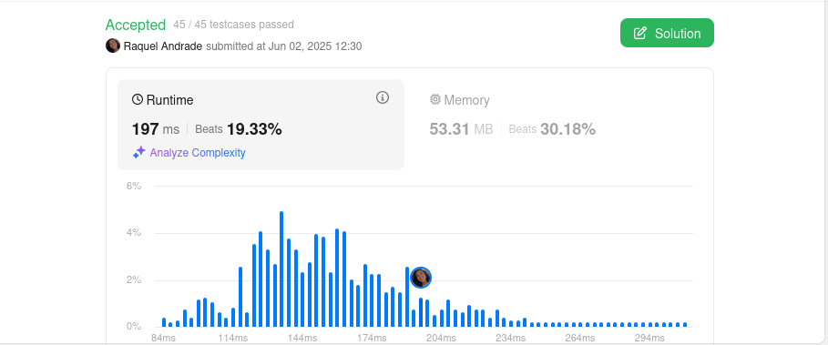
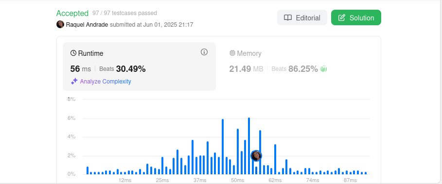
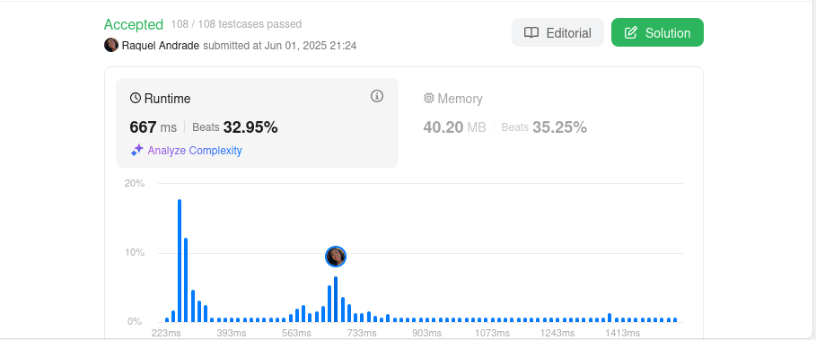

# Greed - LeetCode

**Número da Lista**: X  
**Conteúdo da Disciplina**: Greed 

## Alunos
|Matrícula | Aluno |
| -- | -- |
| 211062437 |  Raquel Ferreira Andrade |
| -  |  - |

## Sobre 
Repositório destinado a resolução de problemas do LeetCode, envolvendo os conceitos estudados em sala de aula do conteúdo de Algoritmos Ambiciosos. 

| Problema | Dificuldade | Resolução |
| -- | -- | -- |
| [1353. Maximum Number of Events That Can Be Attended](https://leetcode.com/problems/maximum-number-of-events-that-can-be-attended/description/) | Média | [Resolução](/code/1353.py) |
| [630. Course Schedule III](https://leetcode.com/problems/course-schedule-iii/description/) | Difícil | [Resolução](/code/630.py) |
| [1606. Find Servers That Handled Most Number of Requests](https://leetcode.com/problems/find-servers-that-handled-most-number-of-requests/description/) | Difícil | [Resolução](/code/1606.py) |

## Screenshots

## Instalação 
**Linguagem**: Python
